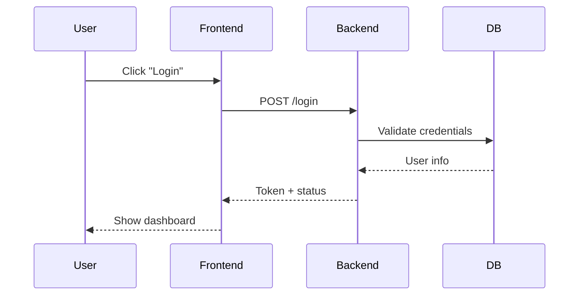

```mermaid
sequenceDiagram
    participant User
    participant Frontend
    participant Backend
    participant DB

    User->>Frontend: Click "Login"
    Frontend->>Backend: POST /login
    Backend->>DB: Validate credentials
    DB-->>Backend: User info
    Backend-->>Frontend: Token + status
    Frontend-->>User: Show dashboard
```
