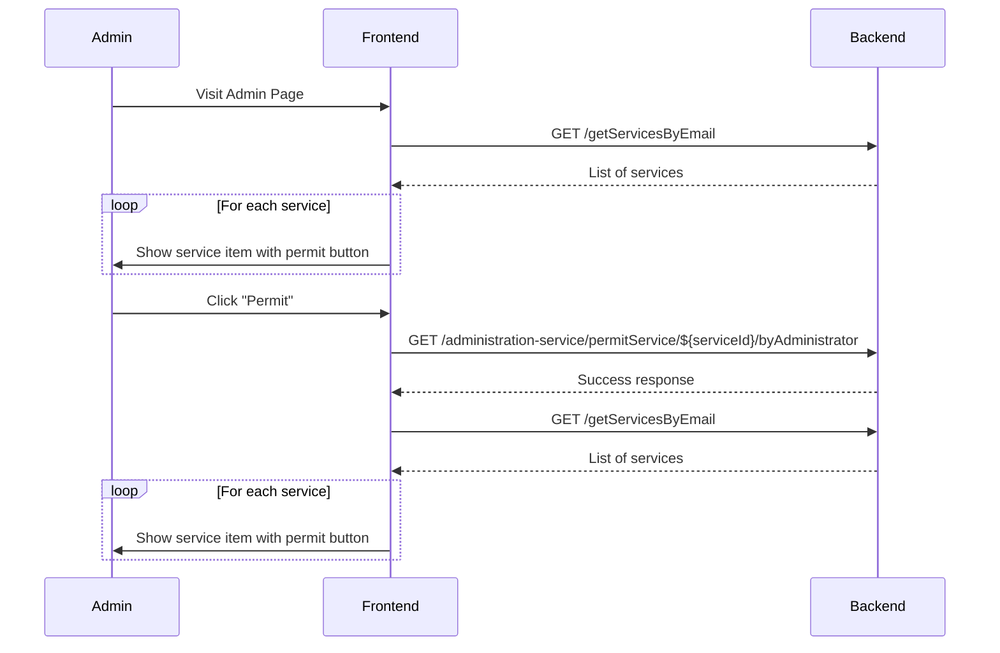

```mermaid
sequenceDiagram
    participant Admin
    participant Frontend
    participant Backend

    Admin->>Frontend: Visit Admin Page
    Frontend->>Backend: GET /getServicesByEmail
    Backend-->>Frontend: List of services
    loop For each service
        Frontend->>Admin: Show service item with permit button
    end
    Admin->>Frontend: Click "Permit"
    Frontend->>Backend: GET /administration-service/permitService/${serviceId}/byAdministrator
    Backend-->>Frontend: Success response
    Frontend->>Backend: GET /getServicesByEmail
    Backend-->>Frontend: List of services
    loop For each service
        Frontend->>Admin: Show service item with permit button
    end
```
