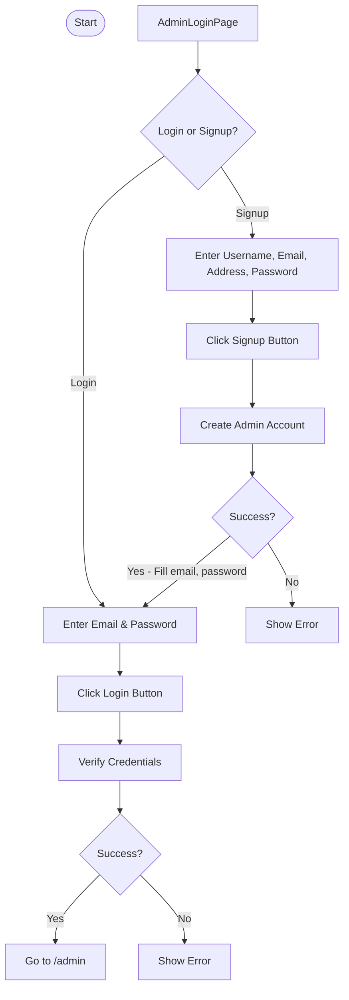

```mermaid
flowchart TD
    Start([Start])
    A[AdminLoginPage]
    A --> B{Login or Signup?}
    B -- Login --> C[Enter Email & Password]
    C --> D[Click Login Button]
    D --> E[Verify Credentials]
    E --> F{Success?}
    F -- Yes --> G[Go to /admin]
    F -- No --> H[Show Error]

    B -- Signup --> I[Enter Username, Email, Address, Password]
    I --> J[Click Signup Button]
    J --> K[Create Admin Account]
    K --> L{Success?}
    L -- Yes - Fill email, password --> C
    L -- No --> P[Show Error]

```