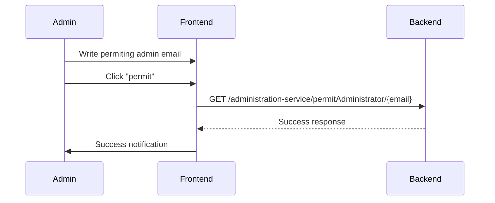

```mermaid
sequenceDiagram
    participant Admin
    participant Frontend
    participant Backend

    Admin->>Frontend: Write permiting admin email
    Admin->>Frontend: Click "permit"
    Frontend->>Backend: GET /administration-service/permitAdministrator/{email}
    Backend-->>Frontend: Success response
    Frontend->>Admin: Success notification
```