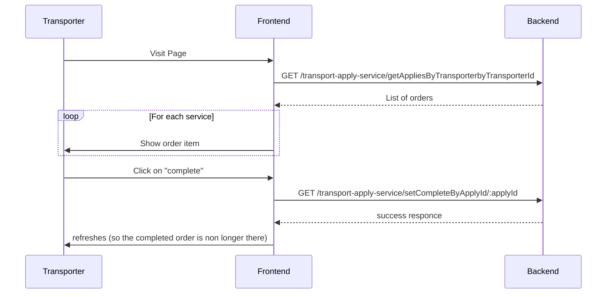

```mermaid
sequenceDiagram
    participant Transporter
    participant Frontend
    participant Backend

    Transporter->>Frontend: Visit Page
    Frontend->>Backend: GET /transport-apply-service/getAppliesByTransporterbyTransporterId
    Backend-->>Frontend: List of orders
    loop For each service
        Frontend->>Transporter: Show order item
    end
    Transporter->>Frontend: Click on "complete"
    Frontend->>Backend: GET /transport-apply-service/setCompleteByApplyId/:applyId
    Backend-->>Frontend: success responce
    Frontend->>Transporter: refreshes (so the completed order is non longer there)
```
