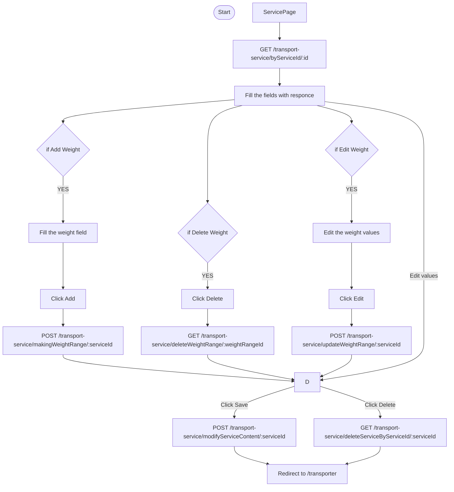

```mermaid
flowchart TD
Start([Start])
    A[ServicePage]
    A --> B[GET /transport-service/byServiceId/:id]
    B --> C[Fill the fields with responce]

    C --> D1{if Add Weight}
    D1 -- YES --> E1[Fill the weight field]
    E1 --> F1[Click Add]
    F1 --> G1[POST /transport-service/makingWeightRange/:serviceId]

    G1 --> D
    C --> D2{if Delete Weight}
    D2 -- YES --> F2[Click Delete]
    F2 --> G2[GET /transport-service/deleteWeightRange/:weightRangeId]

    G2 --> D
    C --> D3{if Edit Weight}
    D3 -- YES --> E3[Edit the weight values]
    E3 --> F3[Click Edit]
    F3 --> G3[POST /transport-service/updateWeightRange/:serviceId]
    G3 --> D
    C -- Edit values --> D
    D -- Click Save --> E[POST /transport-service/modifyServiceContent/:serviceId]
    E --> F[Redirect to /transporter]
    D -- Click Delete --> G[GET /transport-service/deleteServiceByServiceId/:serviceId] --> F
   
```