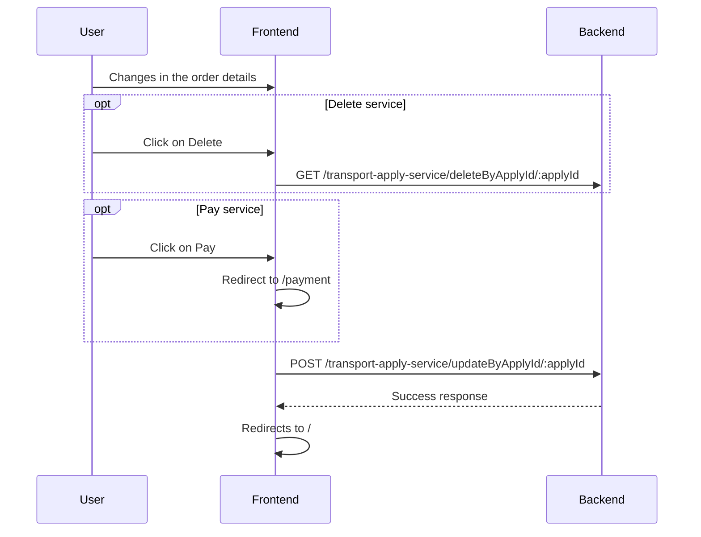

```mermaid
sequenceDiagram
    participant User
    participant Frontend
    participant Backend

    
    User->>Frontend: Changes in the order details
    opt Delete service
        User->>Frontend: Click on Delete
        Frontend->>Backend: GET /transport-apply-service/deleteByApplyId/:applyId
    end
    opt Pay service
        User->>Frontend: Click on Pay
        Frontend->>Frontend: Redirect to /payment
    end
    Frontend->>Backend: POST /transport-apply-service/updateByApplyId/:applyId
    Backend-->>Frontend: Success response
    Frontend->>Frontend: Redirects to /

```