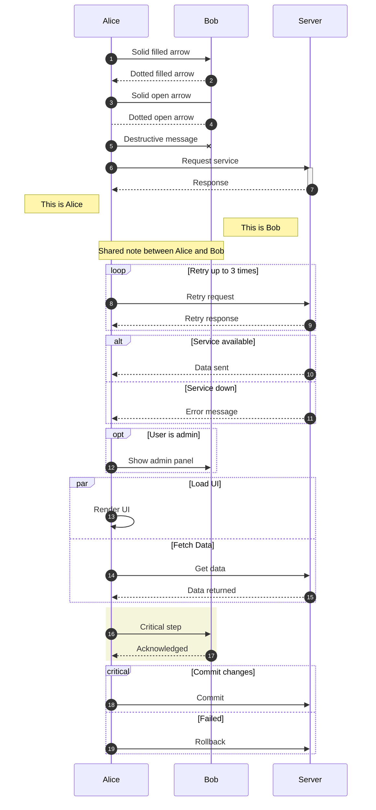

```mermaid
sequenceDiagram
    autonumber

    %% Participants
    participant A as Alice
    participant B as Bob
    participant S as Server

    %% Basic message types
    A->>B: Solid filled arrow
    B-->>A: Dotted filled arrow
    A->B: Solid open arrow
    B-->A: Dotted open arrow
    A-xB: Destructive message

    %% Activation / Deactivation
    A->>S: Request service
    activate S
    S-->>A: Response
    deactivate S

    %% Notes
    Note left of A: This is Alice
    Note right of B: This is Bob
    Note over A,B: Shared note between Alice and Bob

    %% Loops
    loop Retry up to 3 times
        A->>S: Retry request
        S-->>A: Retry response
    end

    %% Alternatives (if/else)
    alt Service available
        S-->>A: Data sent
    else Service down
        S-->>A: Error message
    end

    %% Optional execution
    opt User is admin
        A->>B: Show admin panel
    end

    %% Parallel execution
    par Load UI
        A->>A: Render UI
    and Fetch Data
        A->>S: Get data
        S-->>A: Data returned
    end

    %% Rectangular highlighting
    rect rgb(245,245,220)
        A->>B: Critical step
        B-->>A: Acknowledged
    end

    %% Critical block
    critical Commit changes
        A->>S: Commit
    option Failed
        A->>S: Rollback
    end

```