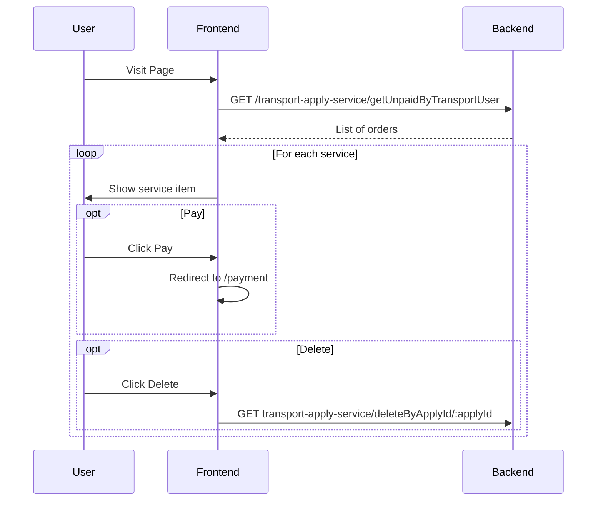

```mermaid
sequenceDiagram
    participant User
    participant Frontend
    participant Backend

    User->>Frontend: Visit Page
    Frontend->>Backend: GET /transport-apply-service/getUnpaidByTransportUser
    Backend-->>Frontend: List of orders
    loop For each service
        Frontend->>User: Show service item
        opt Pay
            User->>Frontend: Click Pay
            Frontend->>Frontend: Redirect to /payment
        end
        opt Delete
            User->>Frontend: Click Delete
            Frontend->>Backend: GET transport-apply-service/deleteByApplyId/:applyId
        end
    end
```
